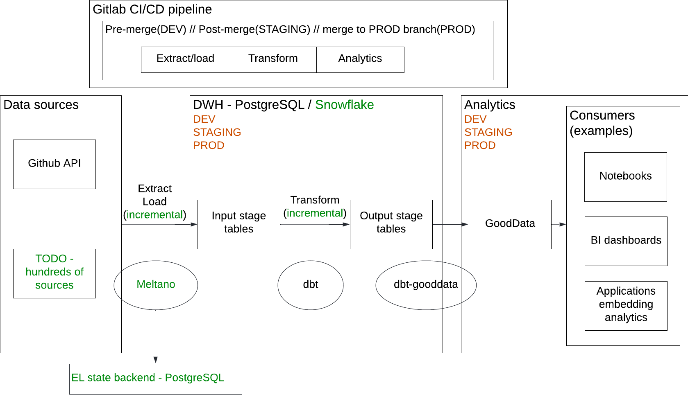

# GoodData Data Pipeline

The demo inside this repository demonstrates e2e data pipeline following best software engineering practices.
It realizes the following steps:
- crawls data from sources with ([Meltano](https://meltano.com/))
- loads data into a warehouse with ([Meltano](https://meltano.com/))
- transforms data in the warehouse in a multi-dimensional model ready for analytics with ([dbt](https://www.getdbt.com/))
- generates semantic model from physical model ([GoodData](https://www.gooddata.com/) model from [dbt](https://www.getdbt.com/) models)
- deploys analytics model (metrics, insights, dashboards) from locally stored [layout files](data_pipeline/gooddata_layouts/)
- deploys UI data apps coupled with the data pipeline. Read more details in [apps folder](apps/) 

Currently, these data warehouse engines are supported:
- PostgreSQL
- Vertica
- Snowflake
- MotherDuck

Delivery into dev/staging/prod environments is orchestrated by [GitHub](https://github.com/) or [Gitlab](https://gitlab.com/) (except the data apps).

Data apps are delivered by [render.com](render.com) service after merge to `main` branch (staging), and after merge to `prod` branch(production).
Also, a preview URL is generated by before merge as a comment in the MR in Gitlab.
Note: Streamlit cloud does not support Gitlab.

Generally, you can change the whole data pipeline and UI apps by a single commit, and deliver everything consistently.

## Architecture picture



## If you need help
This README is just a brief how-to, it does not contain all details. If you need help, do not hesitate to ask in our [Slack community](https://www.gooddata.com/slack/).

## Authors
- [Jan Soubusta](https://twitter.com/jaceksan)
- [Patrik Braborec](https://twitter.com/patrikbraborec)

## Related articles
The following articles are based on this project:
- [How To Build a Modern Data Pipeline](https://medium.com/gooddata-developers/how-to-build-a-modern-data-pipeline-cfdd9d14fbea)
- [How GoodData Integrates With dbt](https://medium.com/gooddata-developers/how-gooddata-integrates-with-dbt-a0c6f207eca3)
- [Extending CI/CD data pipeline with Meltano](https://medium.com/gooddata-developers/extending-ci-cd-data-pipeline-with-meltano-7de3bce74f57)
- [Analytics Inside Virtual Reality: Too Soon?](https://medium.com/gooddata-developers/analytics-inside-virtual-reality-too-soon-41900dac366b)
- [Streamlit meets Headless BI](https://medium.com/gooddata-developers/streamlit-meets-headless-bi-cb6196b69671)
- [Ready, set, integrate: GoodData-dbt integration is production-ready!](https://medium.com/gooddata-developers/ready-set-integrate-gooddata-dbt-integration-is-production-ready-f37daa134455)
- [Data Pipeline as Code: Journey of our Blueprint](https://medium.com/gooddata-developers/data-pipeline-as-code-journey-of-our-blueprint-99912b1485d2)
- TODO: Data apps on top of GoodData + MotherDuck

## Getting Started

I recommend to begin on your localhost, starting the whole ecosystem using [docker compose.yaml](docker compose.yaml) file.
It utilizes the [GoodData Container Edition](https://hub.docker.com/r/gooddata/gooddata-cn-ce) available in DockerHub.
Optionally, you can also start [Vertica Community Edition](https://hub.docker.com/r/vertica/vertica-ce).

*WARNING:* 
Since version 3.0.0, the GoodData.CN Community Edition will be renamed to GoodData.CN Container Edition, and will require a license key for its run.
If you are a GoodData customer, you can use the same license key as for the production deployment.
If not, please, contact us in our [Slack Community](https://www.gooddata.com/slack/).

*Personal note:*
I was fighting with the above decision for a long time, but finally, I lost. I encourage you to ask for a return of a free Community Edition in the Slack community.
The more people ask, the more chances we have to get it back.

*Design note:*
- All env variables for all environments are stored in .env files.
- All executions (extract_load, transform, analytics) are orchestrated by make targets.
  - This is valid for docker compose, local shell and Gitlab/GitHub CI/CD.

```bash
# Build custom images based on Meltano, dbt and GoodData artefacts
docker compose build
# Start GoodData, and Minio(AWS S3 Meltano state backend)
docker compose up -d gooddata-cn-ce minio minio-bootstrap
# Wait 1-2 minutes to services successfully start
# Optionally, start Vertica
docker compose up -d vertica

# Allow https://localhost:8443 in CORS
# This enables testing of locally started UI apps based on UI.SDK (examples in /apps folder) 
docker compose up bootstrap_origins

# Extract/load pipeline based on Meltano
# Github token for authenticating with Github REST API 
export TAP_GITHUB_AUTH_TOKEN="<my github token>"
# Jira user/pwd for authenticating with Jira REST API 
export TAP_JIRA_AUTH_PASSWORD="<token>"
export TAP_JIRA_AUTH_USERNAME="<user - e-mail>"
# If you use your own Vertica
export VERTICA_PASS="<your Vertica password>" 
# If you use MotherDuck
export MOTHERDUCK_TOKEN="<your MotherDuck token>" 
docker compose up extract_load_github
docker compose up extract_load_faa
docker compose up extract_load_data_science
docker compose up extract_load_ecommerce_demo
docker compose up extract_load_jira

# Transform model to be ready for analytics, with dbt
# Also, GoodData models are generated from dbt models and pushed to GoodData  
docker compose up transform  

# Deliver analytics artefacts(metrics, visualizations, dashboards, ...) into GoodData
docker compose up analytics
```

Once everything finishes successfully, you can go to [http://localhost:3000](http://localhost:3000), 
log in with `demo@example.com`/`demo123`, and start consuming the result of the data pipeline in the form of dashboards.

There is also an alternative consumption experience - you can start data apps stored in [apps](apps/) folder.
check corresponding README files in sub-folders each representing a particular app.

## Getting started - cloud

Move to Gitlab/GitHub, fork this repository and run the pipeline against your environments:
- Create a public GoodData instance
    - Go to [GoodData trial](https://www.gooddata.com/trial/) page, enter your e-mail,
        and in few tens of seconds you get your own GoodData instance running in our cloud, managed by us.
- Create a public PostgreSQL/Vertica/Snowflake/MotherDuck instance
  - Create required databases (for dev/staging/prod).
 
You have to set the following (sensitive) environment variables in the Gitlab(section Settings/CICD) or GitHub(section Settings/Secrets) UI:
- TAP_GITHUB_AUTH_TOKEN - to allow Meltano to crawl data from Github
- TAP_JIRA_AUTH_USERNAME and TAP_JIRA_AUTH_PASSWORD - to allow Meltano to crawl data from Jira
- GoodData
  - Single endpoint, host+port 
    - GOODDATA_HOST - host name pointing to the GoodData instance
    - GOODDATA_TOKEN - admin token to authenticate against the GoodData instance
  - Multiple endpoints (recommended)
    - Create file ~/.gooddata/profiles.yaml
    - Check [Example](data_pipeline/gooddata_profiles.yaml)
- MELTANO_STATE_AWS_ACCESS_KEY_ID/MELTANO_STATE_AWS_SECRET_ACCESS_KEY - Meltano stores its state to AWS S3, and needs these credentials
- GITLAB_TOKEN - to allow Gitlab jobs to send messages to merge requests
- BOT_GITHUB_TOKEN - to allow GitHub jobs to send messages to pull requests

## Developer guide

Bootstrap developer environment:
```bash
# Creates virtualenv and installs all dependencies
make dev

# Activate virtualenv for extract_load part or for transform/analytics parts
source .venv_el/bin/activate
# Activate virtualenv for transform and analytics parts
source .venv_t/bin/activate
# You should see e.g. a `(.venv_el)` appear at the beginning of your terminal prompt indicating that you are working inside the `virtualenv`.

# TODO: once my PR https://github.com/meltano/meltano/pull/8302 is merged, we can merge two venvs into one

# Deactivate virtual env once you are done
deactivate
```

### Set environment variables
See [.env.local](.env.local) and similar examples. 
Add sensitive variables to the corresponding .env.custom.<local|dev|staging|prod> file.
Some env files support multiple (database) options.

```bash
source .env.local
# For vertica
source .env.local vertica
# For MotherDuck
source .env.local motherduck
# For Vertica in the cloud
source .env.staging vertica
```

### Extract and Load
Meltano tool is used. Configuration file [meltano.yml](data_pipeline/meltano.yml) declares everything related.

How to run:
```bash
make extract_load
# Full refresh
FR="--full-refresh" make extract_load
```
Several jobs are running for each combination of source(tap) and target.
The output of this stage are multiple DB schemas.
Schema names are declared in [.env.local](.env.local).

Jobs are running incrementally. They store their states into AWS S3 (or local Minio).
You can use `--full-refresh` flag to enforce full refresh of the whole model.

### Data transformation
The folder `data_pipeline/models` contains [dbt models](https://docs.getdbt.com/docs/building-a-dbt-project/building-models) to transform data from all schemas produced by the previous step to `cicd_output_stage` schema that is used for analytics of data. You can use `--full-refresh` flag to enforce full refresh of the whole model.

How to run:
```bash
make transform
# Full refresh
FR="--full-refresh" make transform
# Dry run
FR="--dry-run" make transform
```

### Generate GoodData semantic model from dbt models
Plugin [gooddata-dbt](https://github.com/gooddata/gooddata-python-sdk/gooddata-dbt) provides generators of GoodData semantic model objects from dbt models.
In particular, it allows you to generate so called GoodData LDM(Logical Data Model, mapped to tables/columns), and metrics.
It is based on [GoodData Python SDK](https://github.com/gooddata/gooddata-python-sdk/gooddata-sdk).

How to run:
```bash
make deploy_models
# There are related make target executing atomic steps

# Dry run
FR="--dry-run" make deploy_models
```

For Vertica, we have to customize VERTICA_HOST variable, because Vertica is running inside the docker compose network.
When you run e.g. Meltano from localhost, you connect to localhost.
When GoodData is connecting to Vertica inside the docker network, it must connect to docker hostname of Vertica, which is `vertica`.
```bash
VERTICA_HOST="vertica" gooddata-dbt deploy_models
```

## Constraints
We wanted to define database constraints. Why? [GoodData](https://www.gooddata.com/) can join automatically between tables if you have tables that have foreign keys. This is a huge benefit that saves time, and also you can avoid mistakes thanks to that.

We used package [Snowflake-Labs/dbt_constraints](https://github.com/Snowflake-Labs/dbt_constraints) for defining constrains.

Another option is to declare these semantic properties into GoodData-specific `meta` sections in dbt models (it is utilized in this demo).

## Schema names
The dbt autogenerates the schema name but you can easily change it by custom macro - see our [approach how we dealt with schema names](data_transformation/macros/generate_schema_name.sql).

## Generate all columns into schema.yml files
This can help you to bootstrap schema.yaml files programmatically. Then, you can extend them by additional properties.

Example:
```bash
dbt --profiles-dir profile run-operation generate_source \
  --args "{\"schema_name\": \"$INPUT_SCHEMA_GITHUB\", \"generate_columns\": true, \"include_descriptions\": true}"
```

# Analytics
Folder [gooddata-dbt](data_pipeline/gooddata-dbt) contains a PoC of dbt plugin providing tools for loading/storing GoodData analytics model (metrics, insights, dashboards).
It is based on [GoodData Python SDK](https://github.com/gooddata/gooddata-python-sdk).

## Load analytics model to GoodData
Analytics model is stored in [gooddata_layouts](data_pipeline/gooddata_layouts) folder.

The following command reads the layout, and loads it into the GooData instance:
```bash
make deploy_analytics
# Dry run
FR="--dry-run" make deploy_analytics
```

It not only loads the stored layout, but it also reads metrics from dbt models and loads them too.

## Store analytics model
Anytime you can fetch analytics model from the GoodData instance and store it to [gooddata_layouts](data_pipeline/gooddata_layouts) folder.
It makes sense to do some operations by editing stored layout files, but others in GoodData UI applications.
For instance, it is more convenient to build more complex GoodData MAQL metrics in the Metric Editor UI application.
Then, to persist such metrics to [gooddata_layouts](data_pipeline/gooddata_layouts) folder, run the following command:

```bash
GOODDATA_PROFILES="local" make store_analytics
```

WARNING: if you utilize ~/.gooddata/profiles.yaml, and you would fill GOODDATA_PROFILES variable with multiple values, 
it will store analytics from all related GoodData instances into the same folder. This is not what you usually need.
That is why I override GOODDATA_PROFILES variable with a single value.

## Invalidate analytics cache 

Anytime you update data, e.g. by running `dbt run` command, you have to invalidate GoodData caches to see the new data there.
The following command invalidates these caches:
```bash
make invalidate_caches
```

### Test analytics

It is possible to test if all insights (visualizations) are possible to execute - it means that you know if insights (visualizations) render correctly.

Use the following command:
```bash
make test_insights
```

### Geo charts
It is necessary to upload Mapbox token to GoodData deployments other than GoodData.cloud (SaaS).
Use helper script for that:
```bash
cd data_pipeline
export MAPBOX_ACCESS_TOKEN="<put your token here>"
python upload_mapbox_token.py -gw faa_development
# If localization is used
python upload_mapbox_token.py -gw faa_development_fr 
python upload_mapbox_token.py -gw faa_development_chinese__simplified_ 
```

## Applications

Applications are stored in [apps](apps/) folder. They are not delivered by the Gitlab pipeline, but by render.com service watching this repo.

### VR demo
[README](apps/vr_analytics/)

### Streamlit demo
[README](apps/streamlit/)

### How to use GoodData SDK in notebooks
[README](apps/jupyter/)

### GoodData UI(Javascript) SDK example
[README](apps/ui_sdk/jireaucracy/)

---

If you want to learn more about the stack described in the document, do not hesitate to contact us.

If you find a bug, please [create a merge request](https://gitlab.com/patrikbraborec/gooddata-data-pipeline/-/merge_requests/new), or [create an issue](https://gitlab.com/patrikbraborec/gooddata-data-pipeline/-/issues/new).
