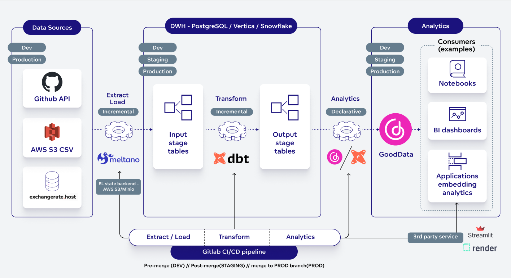

# GoodData Data Pipeline

The demo inside this repository demonstrates e2e data pipeline following best software engineering practices.
It realizes the following steps:
- crawls data from sources ([Meltano](https://meltano.com/))
- loads data into a warehouse ([Meltano](https://meltano.com/))
- transforms data in the warehouse in a multi-dimensional model ready for analytics ([dbt](https://www.getdbt.com/))
- generates semantic model from physical model ([GoodData](https://www.gooddata.com/) model from [dbt](https://www.getdbt.com/) models)

Delivery into dev/staging/prod environments is orchestrated by [Gitlab](https://gitlab.com/).



## If you need help
This README is just a brief how-to, it does not contain all details. If you need help, do not hesitate to ask in our [Slack community](https://www.gooddata.com/slack/).

## Authors
- [Jan Soubusta](https://twitter.com/jaceksan)
- [Patrik Braborec](https://twitter.com/patrikbraborec)

## Related articles
The following articles are based on this project:
- [How To Build a Modern Data Pipeline](https://medium.com/gooddata-developers/how-to-build-a-modern-data-pipeline-cfdd9d14fbea)
- [How GoodData Integrates With dbt](https://medium.com/gooddata-developers/how-gooddata-integrates-with-dbt-a0c6f207eca3)
- TODO - Meltano article

## Getting Started
I recommend to begin on your localhost, starting the whole ecosystem using [docker-compose.yaml](docker-compose.yaml) file.

```bash
# Build custom images based on Meltano, dbt and GoodData artefacts
docker-compose build
# Start GoodData
docker-compose up -d gooddata-cn-ce
# Wait 1-2 minutes to the service successfully starts

# Bootstrap DB schemas
docker-compose up -d bootstrap_db

# Extract/load pipeline based on Meltano
# Github token for authenticating with Github REST API 
export GITHUB_TOKEN="<my github token>"
docker-compose up -d extract_load

# Transform model to be ready for analytics, with dbt
# Also, GoodData models are generated from dbt models and pushed to GoodData  
docker-compose up -d transform  

# Deliver analytics artefacts(metrics, visualizations, dashboards, ...) into GoodData
docker-compose up -d analytics
```

Then you can move to Gitlab, forking this repository and run the pipeline against your environments:
- Create a public GoodData instance
    - Go to [GoodData trial](https://www.gooddata.com/trial/) page, enter your e-mail,
        and in few tens of seconds you get your own GoodData instance running in our cloud, managed by us.
- Create a public PostgreSQL or Snowflake instance
  - Personally, I found [bit.io](https://bit.io/) as the only free-forever PostgreSQL offering.
  - Create required databases (for dev/staging/prod) and schema `meltano` for Meltano state backend.
 
You have to set the following (sensitive) environment variables in the Gitlab(section Settings/CICD):
- GITHUB_TOKEN
- GOODDATA_HOST - host name pointing to the GoodData instance
- GOODDATA_TOKEN - admin token to authenticate against the GoodData instance

The rest of environment variables (Github repos to be crawled, DB endpoints, ...) can be configured in [.gitlab-ci.yml](.gitlab-ci.yml)(section `variables`).

## Developer guide

Bootstrap developer environment:
```bash
# Creates virtualenv and installs all dependencies
make dev

# Activate virtualenv
source .venv/bin/activate
# You should see a `(.venv)` appear at the beginning of your terminal prompt indicating that you are working inside the `virtualenv`.

# Deactivate virtual env once you are done
deactivate
```

### Set environment variables
```bash
export TAP_GITHUB_ACCESS_TOKEN="<your token>"
# The folowing variables are valid for local environment started from docker-compose.yaml
export DBT_PROFILE_DIR="profile"
export ELT_ENVIRONMENT="cicd_dev_local"
export MELTANO_TARGET="target-postgres"

unset GOODDATA_UPPER_CASE
# Set GOODDATA_UPPER_CASE to --gooddata-upper-case when running against Snowflake and DB table/column names are upper-cased
# export GOODDATA_UPPER_CASE="--gooddata-upper-case"
export POSTGRES_HOST="localhost"
export POSTGRES_PORT="5432"
export POSTGRES_USER="demouser"
export POSTGRES_PASS=demopass
export POSTGRES_DBNAME=demo

export INPUT_SCHEMA=cicd_input_stage
export OUTPUT_SCHEMA=cicd_output_stage
export DBT_TARGET_TITLE="CI/CD dev (local)"
export MELTANO_DATABASE_URI="postgresql://$POSTGRES_USER:$POSTGRES_PASS@$POSTGRES_HOST:$POSTGRES_PORT/$POSTGRES_DBNAME?options=-csearch_path%3Dmeltano"
export GOODDATA_WORKSPACE_ID=cicd_demo_development
export GOODDATA_WORKSPACE_TITLE="CICD demo (dev)"
```

### Extract and Load
Meltano tool is used. Configuration file [meltano.yml](src/meltano.yml) declares everything related.

How to run:
```bash
make extract_load
```

The output of this stage is `cicd_input_stage` schema in the database.

It is running incrementally, it stores its state into a dedicated schema `meltano`.
You can use `--full-refresh` flag to enforce full refresh of the whole model.

### Data transformation
The folder `src/models` contains [dbt models](https://docs.getdbt.com/docs/building-a-dbt-project/building-models) to transform data from `cicd_input_stage` to `cicd_output_stage` that is used for analytics of data. You can use `--full-refresh` flag to enforce full refresh of the whole model.

How to run:
```bash
make transform
```

### Generate GoodData semantic model from dbt models
Folder [dbt-gooddata](src/dbt-gooddata) contains a PoC of dbt plugin providing generators of GoodData semantic model objects from dbt models.
In particular, it allows you to generate so called GoodData PDM (Physical Data Model), LDM(Logical Data Model, mapped to PDM), and metrics.
It is based on [GoodData Python SDK](https://github.com/gooddata/gooddata-python-sdk).

How to run:
```bash
make deploy_models
```

## Constraints
We wanted to define database constraints. Why? [GoodData](https://www.gooddata.com/) can join automatically between tables if you have tables that have foreign keys. This is a huge benefit that saves time, and also you can avoid mistakes thanks to that.

We used package [Snowflake-Labs/dbt_constraints](https://github.com/Snowflake-Labs/dbt_constraints) for defining constrains.

Another option is to declare these semantic properties into GoodData-specific `meta` sections in dbt models (it is utilized in this demo).

## Schema names
The dbt autogenerates the schema name but you can easily change it by custom macro - see our [approach how we dealt with schema names](data_transformation/macros/generate_schema_name.sql).

## Generate all columns into schema.yml files
This can help you to bootstrap schema.yaml files programmatically. Then, you can extend them by additional properties.

Example:
```bash
dbt --profiles-dir profile run-operation generate_source \
  --args "{\"schema_name\": \"$OUTPUT_SCHEMA\", \"generate_columns\": true, \"include_descriptions\": true}"
```

# Analytics
Folder [dbt-gooddata](src/dbt-gooddata) contains a PoC of dbt plugin providing tools for loading/storing GoodData analytics model (metrics, insights, dashboards).
It is based on [GoodData Python SDK](https://github.com/gooddata/gooddata-python-sdk).

## Load analytics model to GoodData
Analytics model is stored in [gooddata_layouts](src/gooddata_layouts) folder.

The following command reads the layout, and loads it into the GooData instance:
```bash
make deploy_analytics
```

It not only loads the stored layout, but it also reads metrics from dbt models and loads them too.

## Store analytics model
Anytime you can fetch analytics model from the GoodData instance and store it to [gooddata_layouts](src/gooddata_layouts) folder.
It makes sense to do some operations by editing stored layout files, but other in GoodData UI applications.
For instance, it is more convenient to build more complex GoodData MAQL metrics in the Metric Editor UI application.
Then, to persist such metrics to [gooddata_layouts](src/gooddata_layouts) folder, run the following command:

```bash
make store_analytics
```

## Invalidate analytics cache 

Anytime you update data, e.g. by running `dbt run` command, you have to invalidate GoodData caches to see the new data there.
The following command invalidates these caches:
```bash
make invalidate_analytics_caches
```

### Test analytics

It is possible to test if all insights (visualizations) are possible to execute - it means that you know if insights (visualizations) render correctly.

Use the following command:
```bash
make test_insights
```

---

If you want to learn more about the stack described in the document, do not hesitate to contact us.

If you find a bug, please [create a merge request](https://gitlab.com/patrikbraborec/gooddata-data-pipeline/-/merge_requests/new), or [create an issue](https://gitlab.com/patrikbraborec/gooddata-data-pipeline/-/issues/new).
